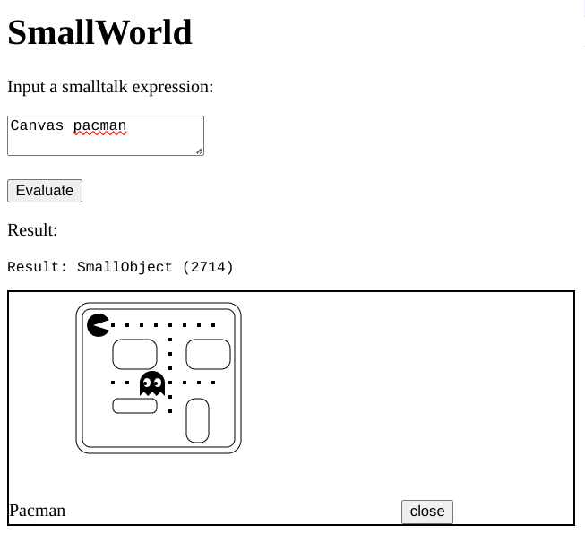

# smallworld.js

smallworld.js is a translation of Timothy Budd's SmallWorld into JavaScript.
SmallWorld is a Java implementation of a very basic Smalltalk virtual machine.
Thus, smallworld.js is a Smalltalk virtual machine written in JavaScript.

This was a hand translation of Java to JavaScript, and accepts the same bytecode
format as the one I used in my
[SmallWorld](https://github.com/ericscharff/SmallWorld) fork. Similar to the
Java version, every Smalltalk object corresponds to a JavaScript object. Thus,
the JavaScript runtime does all the memory management and garbage collection.
This isn't a particularly fast or elegant Smalltalk VM, but it is very simple,
and relies on the fact that modern systems are very fast, and JavaScript
runtimes are quite good, so using the system has reasonable performance.

## Status

The current implementation is extremely minimalist. The GUI is rough and
incomplete. However, what is here is capable of running a fairly large amount of
Smalltalk code correctly, including basic arbitrary precision arithmetic, string
manipulation, and adding new methods to existing classes. See the tests in
[interpreter.js](test/interpreter.js) (and related) for more details.

The main interpreter can be used "headless" - you can run basic Smalltalk code
without a GUI. You can optionally add a UI Handler (which adds the UI
primitives) but the base system doesn't depend on it. The UI Handler itself
doesn't do much either, it depends on a UI implementation (called the UI
factory) which presents the Smalltalk UI concepts in a browser using the HTML
DOM APIs. These are all included here, but since the interpreter doesn't depend
directly on any UI, it could be used for embedding in other systems.

## Running

After cloning, use `npm install` to install the dependencies (only needed for
running unit tests). Running `npm test` will run the test suite in test.js.

There is a [simple REPL](scripts/repl.js) in the `scripts` directory that you
can run from the command line with `node repl.js` or `./repl.js`. Lines on the
command line will be compiled and run with `doIt`.

You can run a very rudimentary version of the interpeter by loading
[index.html](html/index.html) in a Web browser. You can evaluate expressions and
the result will be printed below.

## Why?

I have always been fascinated by Smalltalk, especially the programming paradigm
of using a virtual image (snapshot of all of the objects in a system). This kind
of Smalltalk provides a level of system introspection and manipulation that is
rare in other programming systems. Budd's Little Smalltalk and SmallWorld are
especially interesting Smalltalk variants, because a very few Smalltalk classes
and a relatively small virtual machine can accomplish a great deal. The base
image is made from 41 classes. The whole environment (full source code,
bytecode, programming tools, and so on) is made from 4924 objects, taking up
less than 170K of disk space (and considerably less with some deduplication).

I've written many interpreters and compilers over the years, and I even took Tim
Budd's original SmallWorld and cleaned up the code a bit. However, I never
really understood his Java code, or deeply how a Smalltalk virtual machine works
and how the illusion of "everything is an object" can be maintained.

Porting from Java to JavaScript has therefore been a personal journey of
discovery to understand the inner workings of the virtual machine. My rough
notes along the way are in [NOTES.md](doc/NOTES.md).

## SmallWorld in Action

Here is the HTML UI showing off SmallWorld's integration with the HTML Canvas
API:

